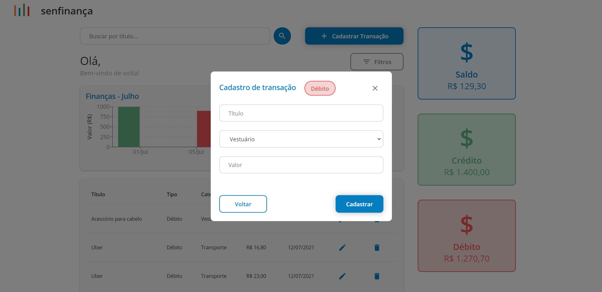
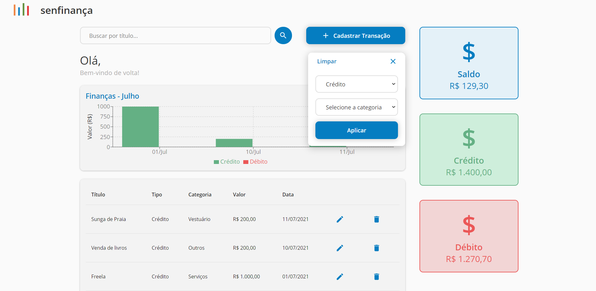
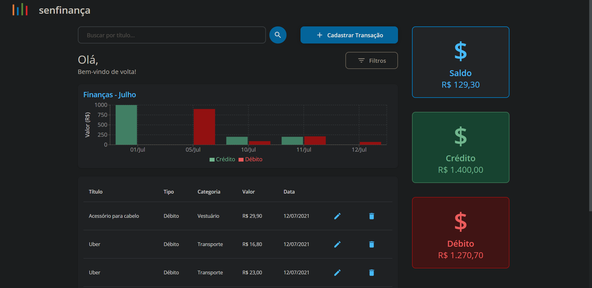

# senfinaça

O senfinanca é uma aplicação para gerenciar transações. Uma vez no site, o usuário pode cadastrar transações de entrada (crédito) ou saída (débito) e acompanhar suas finanças de maneira simplificada e direto ao ponto.

A aplicação Single Page Application (SPA) foi desenvolvida usando [React JS](https://pt-br.reactjs.org/) e consome dados de um banco de dados NoSQL, [Cloud Firestore](https://firebase.google.com/docs/firestore). Além de React e Firebase, outras tecnologias foram utilizadas no projeto, tais como: [TypeScript](https://www.typescriptlang.org/), [Material UI](https://material-ui.com/), [Recharts](https://recharts.org/en-US/), [Styled Components](https://styled-components.com/) e mais.
## Preview

É possível visualizar dados de transações anteriores, editar ou deletar se for necessário. Além disso também é possível acompanhar as transações do mês através do gráficoas totalizações de entradas e saídas, e também o saldo restante.

### **Dashboard**


### **Cadastro de transação**



### **Filtros**



### Filtros implementados:

- Tipo
- Categoria
- Palavra chave (Título)

## Requirements

- Node.js LTS release or greater
- Yarn (opicional)
- Git

## Built With

- React (17.0.2)
- Typescript (4.1.2)

## Documentation

- [React JS](https://reactnative.dev/docs/environment-setup)
- [Unform](https://unform.dev)
- [Cloud Firestore](https://firebase.google.com/docs/firestore)

### Quick running

Assumingo que o [Git](https://git-scm.com/) e o [NodeJS LTS](https://nodejs.org/en/) estão instalados, é possível seguir os seguintes passos:

1. Faça clone do projeto e vá para a raiz do repositório

   ```bash
   git clone https://github.com/ozielalves/senfinanca.git && cd senfinanca/
   ```

2. Na raiz do repositório, instale as dependências necessárias

   ```bash
   npm install

   # or

   yarn install
   ```

3. Rodando o projeto localmente

   ```bash
   npm start

   # or

   yarn start
   ```

Pronto! Será exibida a seguinte mensagem e já é possível codar:

```bash
Compiled successfully!

You can now view senfinancas in the browser.     

  Local:            http://localhost:3000        
  On Your Network:  http://192.168.2.111:3000    

Note that the development build is not optimized.
To create a production build, use yarn build.
```

## Criando build de produção

```bash
   npm run build

   # or

   yarn run build
```

## Folder Structure

```bash
senfinanca
├───public
└───src
    ├───assets
    │   ├───icons
    │   └───images
    ├───components
    │   ├───Button
    │   ├───Chart
    │   ├───ColoredCard
    │   ├───Copyright
    │   ├───Filters
    │   │   ├───Dropdown
    │   │   └───Search
    │   ├───FinanceStatus
    │   ├───Form
    │   │   ├───Select
    │   │   └───TextField
    │   ├───Header
    │   ├───Modal
    │   │   ├───Deletion
    │   │   ├───Register
    │   │   └───Selection
    │   ├───Paper
    │   ├───SnackbarWapper
    │   └───Table
    ├───hooks
    ├───models
    │   ├───Filter
    │   └───Transaction
    ├───pages
    │   └───Dashboard
    ├───services
    │   └───utils
    └───theme
```

## Observação

Para amantes do dark mode (eu incluso), utilizo uma extensão que realiza faz essa transição automática, o [Dark Reader](https://chrome.google.com/webstore/detail/dark-reader/eimadpbcbfnmbkopoojfekhnkhdbieeh?hl=pt-BR), e adorei o resultado quando aplicado no senfinanca:



Como primeiro TODO eu coloco a implementação do dark mode!

## Contribuições

Fique a vontade para contribuir! Basta criar Pull Requests.

Para maiores modificações, por favor, abrir um issue para discutir o que deve ser modificado.

## Support

- [Twitter @ozielvales](https://twitter.com/ozielvales) | [E-mail](mailto:ozielalves7@gmail.com)

## Author

- [Oziel Alves](https://github.com/ozielalves)
